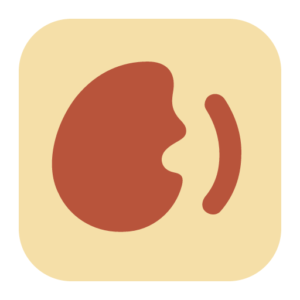
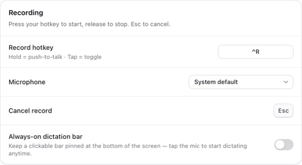
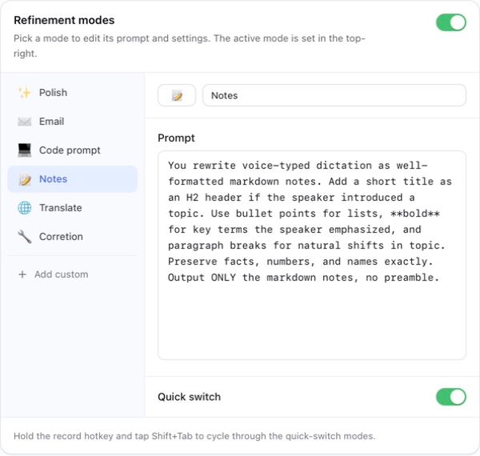
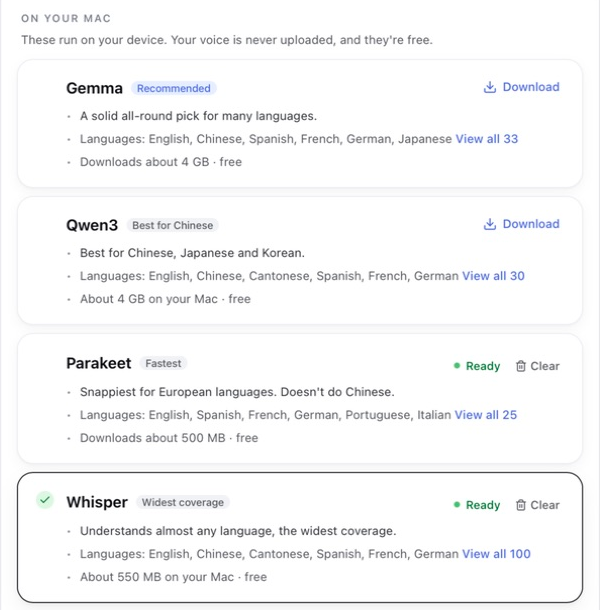

<p align="center"></p>

<h1 align="center">Vibeking</h1>
<p align="center">說出想法，讓文字出現在你正在使用的 App。</p>
<p align="center"><a href="https://github.com/bblurock/vibeking/releases/latest">下載 Mac 版</a> · <a href="README.md">English</a> · <a href="https://www.benson.lu/project/vibeking">專案介紹</a></p>
<p align="center"><strong>Apple Silicon · macOS 14 以上 · 免費 · MIT</strong></p>
<p align="center"></p>

## 想到，就說出來

- **在原本的 App 裡輸入。** 按住錄音快捷鍵說話，放開後辨識並插入文字。短按可切換免按住錄音，Escape 可取消。
- **選擇語音處理的位置。** 在 Mac 本機執行 Whisper、Parakeet、Qwen3 或 Gemma，也能使用自己的 API 金鑰連接雲端服務。
- **把文字整理成需要的樣子。** 保留原始逐字稿，或用可編輯的模式潤飾句子、整理筆記、撰寫郵件與翻譯。

提供聽寫懸浮列、歷史記錄、自訂詞彙與選用的更正學習。介面支援繁體中文、簡體中文與英文。

## 開始使用

1. 從 [Releases](https://github.com/bblurock/vibeking/releases/latest) 下載 Apple Silicon `.dmg`，打開後將 **Vibeking** 拖到 **應用程式**。
2. 開啟 App，依照引導允許 **麥克風** 與 **輔助使用** 權限。下載本機辨識模型，或設定雲端供應商。
3. 點選文字輸入欄位，按住你設定的快捷鍵，說一句話後放開。建議先關閉潤飾，確認辨識與輸入正常。

本機模型首次使用需要網路下載，並會占用磁碟與記憶體。Gemma 會自動安裝 App 管理的 Python 環境，不需自行安裝 Python。詳見[安裝與疑難排解（英文）](docs/getting-started.md)。

## App 畫面

<details>
<summary>快捷鍵與麥克風</summary>


</details>
<details>
<summary>可編輯的潤飾模式</summary>


</details>
<details>
<summary>本機辨識引擎</summary>


</details>

以上畫面取自[專案介紹頁](https://www.benson.lu/project/vibeking)。模型的速度與準確度會依語言、硬體和錄音而變；介面標籤不是效能測試結果。

App 支援 macOS 14 以上；Qwen3 引擎另需 macOS 15 以上。

## 隱私與費用

本機辨識在模型設定完成後於 Mac 上處理音訊。雲端辨識會將音訊傳送給你選擇的供應商；雲端潤飾會將文字傳送給你設定的語言模型服務。選用的畫面情境功能可能將目前 App 中的詞彙加入辨識請求，可在設定中關閉。

歷史記錄與設定保存在本機。**API 金鑰存於本機設定檔，並非 macOS 鑰匙圈。** 日誌可能含診斷資訊與聽寫片段。公開版本不會自動上傳日誌，也沒有使用分析；回饋按鈕會開啟 GitHub Issues。更新請至 Releases 手動下載。

Vibeking 免費，雲端 API 可能另行收費；模型也有各自的授權條款。詳見[隱私說明（英文）](docs/privacy.md)。

## 從原始碼編譯

需要 Apple Silicon Mac、macOS 14 以上、已選定命令列工具的完整 Xcode、Rust stable、Node.js 22.12 以上，以及 pnpm 10.20.0。

```sh
git clone https://github.com/bblurock/vibeking.git
cd vibeking
pnpm install --frozen-lockfile
bash scripts/fetch-uv.sh
pnpm tauri dev
```

建立本機 App：

```sh
pnpm tauri build --bundles app
```

開發版本使用臨時簽署，不需維護者的憑證或私人設定檔。詳見[開發指南（英文）](docs/development.md)。

## 歡迎貢獻

歡迎回報問題、改善文件、翻譯與提交聚焦的 Pull Request。請參考[貢獻指南](CONTRIBUTING.md)；安全性問題請依照 [SECURITY.md](SECURITY.md) 私下回報。

目前僅支援 Apple Silicon Mac。部分受保護欄位或自訂編輯器可能需要手動貼上。較大的模型需要數 GB 記憶體；辨識和潤飾可能出錯，送出前請確認姓名、數字與重要內容。尚未內建自動更新。

## 授權

[MIT](LICENSE) © Benson Lu。第三方程式碼、套件與模型保留各自的授權，詳見[第三方聲明](THIRD_PARTY_NOTICES.md)。

由 [Benson Lu](https://www.benson.lu) 製作。
